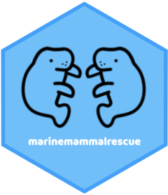

<!-- README.md is generated from README.Rmd. Please edit that file -->

```{r, include = FALSE}
knitr::opts_chunk$set(
  collapse = TRUE,
  comment = "#>",
  fig.path = "man/figures/README-",
  out.width = "100%"
)
```

# marinemammalrescue 

<!-- badges: start -->
<!-- badges: end -->

The goal of marinemammalrescue is to use data to raise awareness around marine animals such as otters, harbor seals, and sea turtles. This sample data was provided by [Marine Mammal Rescue](https://mmrpatients.org/) and provides a tame data set with opportunities for beginner-friendly wrangling and data visualization.  

Please credit (and tag!) Marine Mammal Rescue [on Twitter](https://twitter.com/MarMamRescue) in any public-facing work that you create.

## Installation

You can install the development version of marinemammalrescue [GitHub](https://github.com/) with:

``` r
# install.packages("devtools")
devtools::install_github("kierisi/marinemammalrescue")
```
The data is stored as `marine_mammals`.

## Example graph 

This is a getting started plot that has plenty of room for improvement. Feel free to use this code as a starting point from which to build a better plot. 

```{r example, message = FALSE}
library(marinemammalrescue)
library(ggplot2)
library(dplyr)

marine_mammals %>% 
  count(collection_site) %>% 
  slice_max(n = 5, order_by = n, with_ties = FALSE) %>% 
  ggplot(aes(n, reorder(collection_site, n))) +
  geom_col() +
  labs(
    title = "Top five collection sites of Marine Mammals",
    x = "collection sites",
    y = "number of animals collected"
  )
```

## Contributions

I welcome contributions of all kinds, and in particular would like to encourage beginners to consider filing an issue or even making a pull request.  

Please feel free to also contribute a hex sticker as a `.png` file. I would love to create a [`hexwall`](https://github.com/mitchelloharawild/hexwall) of all of our contributions!

## Code of Conduct

Please note that the marinemammalrescue project is released with a [Contributor Code of Conduct](https://contributor-covenant.org/version/2/0/CODE_OF_CONDUCT.html). By contributing to this project, you agree to abide by its terms.

